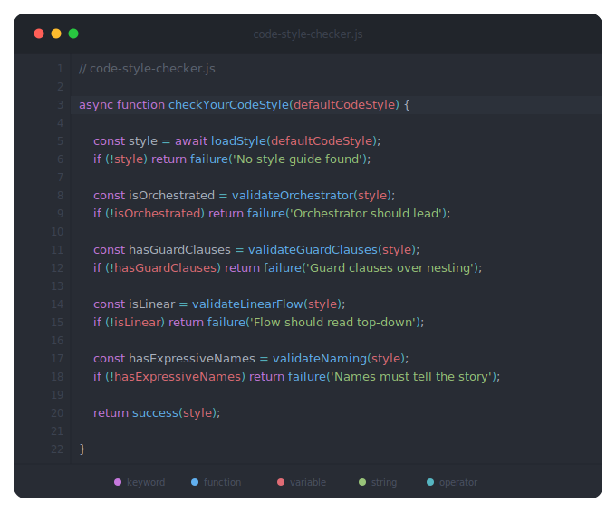

  

 

# Code Style

Olá Dev! Nesse projeto documento meu **code style** (estilo de código) e **setup** (configurações).
Demonstro convenções, padrões e boas práticas que sigo.

> [!NOTE]  
> Busco aprimoramento contínuo. Esse guia é um reflexo do que pratico hoje, não um conjunto fechado
> de regras. Podem existir princípios adicionais ou que se sobrepõem dependendo do contexto: tipo de
> projeto, cultura da empresa ou alinhamento com outros profissionais. O entendimento coletivo
> sempre prevalece.

Para ilustrar os conceitos, uso a metodologia **learn by example** (aprender pelo exemplo).

## O que eu penso sobre código

Penso como um **Resolvedor de Problemas**. Tenho que aplicar as melhores práticas, igual a um
**staff engineer** (engenheiro sênior de alto nível), focando mais no **ciclo de vida completo do
software** do que na implementação imediata.

O **Código serve o time** e a **Governança** cobre todo o ciclo. A **Complexidade tem que ser
abstraída** pra todos entenderem (do não técnico ao especialista), abrindo espaço para novas ideias
e melhorias.

Confira os detalhes em [Governança](docs/shared/process/governance.md).

## Como eu leio e escrevo código.

Os fundamentos aqui são agnósticos de linguagem. Escolhi usar JavaScript como linguagem para
ilustrar os conceitos. Os mesmos princípios se aplicam a qualquer **stack** (combinação de
tecnologias).

> [!NOTE]  
> Ao trabalhar em equipe, a melhor abordagem sempre é a **convenção definida pela organização**.

## Princípios

Cada princípio pode ser aplicado em qualquer linguagem.

Organizados como checklist de revisão, do mais impactante ao mais granular:

- **Forma** — avalia a estrutura da função de fora para dentro
- **Legibilidade** — analisa fluxo, espaçamento e nomes linha a linha
- **Controle de Qualidade** — verifica as garantias de robustez: estado, erros, async e testes

Ver todos os princípios

 

**Forma** — estrutura e narrativa da função

| Princípio                                                                                                  | Descrição                                                        |
| ---------------------------------------------------------------------------------------------------------- | ---------------------------------------------------------------- |
| [Escrita em inglês](docs/javascript/conventions/naming.md#nomes-em-português)                              | Código universal, nomes curtos e sem ambiguidade                 |
| [Código narrativo](docs/javascript/conventions/functions.md#god-function--múltiplas-responsabilidades)     | O código conta a história, sem precisar de comentários           |
| [Ponto de entrada limpo](docs/javascript/conventions/functions.md#ponto-de-entrada-limpo)                  | Caller de uma linha — o quê, não o como                          |
| [Estilo vertical](docs/javascript/conventions/functions.md#estilo-vertical--parâmetros)                    | Até 3 parâmetros por linha — 4+ usa objeto                       |
| [Orquestrador no topo](docs/javascript/conventions/functions.md#god-function--múltiplas-responsabilidades) | Chamada visível antes dos detalhes — top-down                    |
| [Detalhes abaixo](docs/javascript/conventions/functions.md#direct-return)                                  | Helpers ficam abaixo do orquestrador — step-down rule            |
| [Sem lógica no retorno](docs/javascript/conventions/functions.md#sem-lógica-no-retorno)                    | Saída de uma linha — o retorno nomeia o resultado, não o computa |

 

**Legibilidade** — fluxo, densidade visual e nomes

| Princípio                                                                                  | Descrição                                                            |
| ------------------------------------------------------------------------------------------ | -------------------------------------------------------------------- |
| [Retorno antecipado](docs/javascript/conventions/control-flow.md#if-e-else)                | Saída cedo na falha, sem else após return                            |
| [Fluxo linear](docs/javascript/conventions/control-flow.md#aninhamento-em-cascata)         | Aninhamento em cascata substituído por fluxo plano                   |
| [Baixa densidade visual](docs/javascript/conventions/functions.md#baixa-densidade-visual)  | Linhas relacionadas juntas, grupos separados por uma linha em branco |
| [Nomes expressivos](docs/javascript/conventions/naming.md#identificadores-sem-significado) | Variáveis e funções que dispensam explicação                         |
| [Código como documentação](docs/javascript/conventions/naming.md#código-como-documentação) | Nomes substituem comentários — comentários mentem                    |
| [Sem valores mágicos](docs/javascript/conventions/variables.md#evitar-valores-mágicos)     | Constantes nomeadas no lugar de números e strings soltos             |

 

**Controle de Qualidade** — estado, erros, async e testes

| Princípio                                                                                                                    | Descrição                                                    |
| ---------------------------------------------------------------------------------------------------------------------------- | ------------------------------------------------------------ |
| [Funções pequenas](docs/javascript/conventions/functions.md#sla--orquestrador-ou-implementação-nunca-os-dois)                | Uma responsabilidade, um nível de abstração                  |
| [Cálculo vs formatação](docs/javascript/conventions/functions.md#separar-cálculo-de-formatação)                              | Computar dados e formatar saída em funções separadas         |
| [Imutabilidade por padrão](docs/javascript/conventions/variables.md#let-desnecessário)                                       | `const` primeiro, `let` só quando necessário                 |
| [CQS](docs/javascript/conventions/variables.md#mutação-direta-de-objetos)                                                    | Separar comando de consulta, sem efeitos colaterais ocultos  |
| [Dependências explícitas](docs/javascript/conventions/advanced/async.md#api-client-centralizado)                             | Injetar via parâmetros, evitar estado global                 |
| [Falhar rápido](docs/javascript/conventions/advanced/error-handling.md#múltiplos-tipos-de-retorno)                           | Validar cedo, interromper fluxo inválido                     |
| [Retorno explícito](docs/javascript/conventions/advanced/error-handling.md#exceção-como-controle-de-fluxo)                   | Evitar exceções como controle de fluxo                       |
| [Contratos consistentes](docs/javascript/conventions/advanced/error-handling.md#baseerror--abstração-centralizada)           | Respostas padronizadas, sempre o mesmo formato               |
| [Tratamento centralizado de erros](docs/javascript/conventions/advanced/error-handling.md#baseerror--abstração-centralizada) | Classes de erro tipadas, try/catch nas fronteiras            |
| [I/O assíncrono](docs/javascript/conventions/advanced/async.md#callback-hell)                                                | `async/await`, sem bloqueio                                  |
| [Testes estruturados](docs/javascript/conventions/advanced/testing.md#fases-misturadas--aaa)                                 | AAA — fases explícitas; assert limpo — sem expressões inline |

## Seções

### Linguagens

Ver todas as linguagens

 

| Linguagem                               | Descrição                                                        |
| --------------------------------------- | ---------------------------------------------------------------- |
| [HTML](docs/html/README.md)             | Semântica, acessibilidade, performance, SEO, jQuery              |
| [JavaScript](docs/javascript/README.md) | Fundamentos ilustrados com JS — variáveis, funções, fluxo, async |
| [TypeScript](docs/typescript/README.md) | Tipos, interfaces, narrowing, generics, null-safety              |
| [CSS](docs/css/README.md)               | BEM, custom properties, mobile-first, Tailwind, Bootstrap        |
| [C#](docs/csharp/README.md)             | Convenções C#/.NET — records, Result\<T\>, async, LINQ              |
| [VB.NET](docs/vbnet/README.md)          | Convenções VB.NET/.NET Framework 4.8 — legado, async, LINQ          |
| [Python](docs/python/README.md)         | Convenções Python 3.14 — dataclasses, async, Pydantic, match/case   |
| [SQL](docs/sql/README.md)               | Formatação e nomenclatura para SQL Server e PostgreSQL              |

### Conceitos Compartilhados

Ver todos os conceitos

 

**Processo** — como o time trabalha e entrega

| Tópico | Descrição |
| --- | --- |
| [Governance](docs/shared/process/governance.md) | Pensamento de staff engineer, SDLC, onboarding e governança do projeto |
| [Methodologies](docs/shared/process/methodologies.md) | DDD, BDD, TDD, XP, XGH, desenvolvimento orgânico + Monolito, Microsserviços, Monolito Modular |
| [Git](docs/shared/process/git.md) | Branches, commits, pull requests e estratégia de entrega |
| [CI/CD](docs/shared/process/ci-cd.md) | Pipeline, deploy vs release, feature flags, TBD e fix forward |

 

**Arquitetura** — como o código é estruturado

| Tópico | Descrição |
| --- | --- |
| [Principles](docs/shared/architecture/principles.md) | Todos os princípios explicados: Forma, Legibilidade, Controle de Qualidade |
| [Architecture](docs/shared/architecture/architecture.md) | Vertical Slice, MVC, Legacy, XP e XGH com estrutura de pastas |
| [Component Architecture](docs/shared/architecture/component-architecture.md) | Composição, container/presentational, estado, memoization, fronteiras |
| [Patterns](docs/shared/architecture/patterns.md) | Result, Factory, Repository, Strategy, Observer, Builder, Decorator, CQRS, AI-Driven, SDD |
| [Scaling](docs/shared/architecture/scaling.md) | Load Balancing, API Gateway, escala vertical e horizontal, estratégias e anti-overengineering |
| [Operation Flow](docs/shared/architecture/operation-flow.md) | Fluxo de operação backend e frontend: puro nas bordas, I/O no meio, CQS |
| [Frontend Flow](docs/shared/architecture/frontend-flow.md) | Routing, guards, loaders, layouts aninhados, forms e updates otimistas |
| [Backend Flow](docs/shared/architecture/backend-flow.md) | Background jobs, webhooks e event-driven: outbox, idempotência, DLQ e envelope |

 

**Qualidade** — como o código é escrito

| Tópico | Descrição |
| --- | --- |
| [Visual Density](docs/shared/standards/visual-density.md) | Densidade visual agnóstica de linguagem: princípios e regras |
| [Null Safety](docs/shared/standards/null-safety.md) | Fronteira vs interior, contratos de entrada e schema evolution |
| [Testing](docs/shared/standards/testing.md) | AAA, no logic no assert, testes unitários e de integração |
| [Observability](docs/shared/standards/observability.md) | Logging estruturado, níveis, PII, correlation ID |
| [UI/UX](docs/shared/standards/ui-ux.md) | Espaçamento, tipografia, temas claro/escuro, acessibilidade e estados |
| [EditorConfig](docs/shared/standards/editorconfig.md) | Configuração base de editor compatível com qualquer stack |

 

**Plataforma** — infraestrutura e configuração

| Tópico | Descrição |
| --- | --- |
| [Security](docs/shared/platform/security.md) | Segredos, configuração em camadas, autorização e blindagem de cookies |
| [Configuration](docs/shared/platform/configuration.md) | Config vs secret, precedência, layering, tipagem e fail-fast |
| [Feature Flags](docs/shared/platform/feature-flags.md) | Toggle por propósito, rollout, dark launch, kill switch e dívida |
| [Performance](docs/shared/platform/performance.md) | Paginação, cache, filas assíncronas, webhook, polling, WebSocket, lazy loading e Big O |
| [Database](docs/shared/platform/database.md) | SQL vs NoSQL, tuning de queries, plano de execução e troubleshooting de gargalos |
| [Integrations](docs/shared/platform/integrations.md) | GraphQL, TOML, YAML, XML/SOAP (NF-e, CT-e), CNAB, SPED, ZPL e porta serial |
| [Messaging](docs/shared/platform/messaging.md) | Broker, queue, pub/sub, garantias de entrega, DLQ, idempotência e backpressure |
| [Cloud](docs/shared/platform/cloud.md) | Serviços gerenciados, least privilege, containers e ambientes |

### Changelog

Ver [CHANGELOG.md](CHANGELOG.md) para o histórico de versões e releases.

### Referências

Ver [REFERENCES.md](REFERENCES.md) para todos os links organizados por tema.
