# Formatting

A ordem de propriedades não é arbitrária. Agrupar por responsabilidade — posicionamento, box model,
tipografia, visual — torna um bloco CSS legível de cima pra baixo: de "onde está e qual o tamanho"
para "como parece".

## Ordem de propriedades

<details>
<br>
<summary>❌ Bad — ordem aleatória, difícil de escanear</summary>

```css
.card {
  background: white;
  position: relative;
  font-size: 1rem;
  width: 320px;
  border-radius: 8px;
  display: flex;
  color: #111;
  z-index: 1;
  padding: 24px;
  flex-direction: column;
  box-shadow: 0 2px 8px rgba(0, 0, 0, 0.08);
  line-height: 1.5;
}
```

</details>

<br>

<details>
<br>
<summary>✅ Good — agrupado por responsabilidade, legível de cima pra baixo</summary>

```css
.card {
  position: relative;
  z-index: 1;

  display: flex;
  flex-direction: column;
  width: 320px;
  padding: 24px;

  font-size: 1rem;
  line-height: 1.5;
  color: var(--color-text);

  background: var(--color-surface);
  border-radius: 8px;
  box-shadow: 0 2px 8px rgba(0, 0, 0, 0.08);
}
```

<div align="left">
  
</div>

</details>

## Uma propriedade por linha

<details>
<br>
<summary>❌ Bad — múltiplas propriedades em uma linha, diff ilegível</summary>

<!-- prettier-ignore -->
```css
.button { display: inline-flex; align-items: center; padding: 8px 16px; font-weight: 600; }
```

</details>

<br>

<details>
<br>
<summary>✅ Good — uma propriedade por linha, diff limpo</summary>

```css
.button {
  display: inline-flex;
  align-items: center;
  padding: 8px 16px;
  font-weight: 600;
}
```

</details>
