# Formatos e integrações

> Escopo: transversal. Aplica-se a qualquer linguagem ou stack do projeto.

Um sistema em produção troca dados em vários formatos. O **JSON** (JavaScript Object Notation · Notação de Objetos JavaScript) sobre **HTTP** (HyperText Transfer Protocol · Protocolo de Transferência de Hipertexto) cobre a **API** (Application Programming Interface · Interface de Programação de Aplicações) do seu produto, e o resto chega em outro formato.

É o arquivo que configura a ferramenta, o XML assinado que a Receita exige, o arquivo de retorno do banco, a etiqueta que a impressora térmica imprime, os bytes que a balança envia pela porta serial. Este guia cobre os formatos e protocolos mais comuns, dos modernos aos legados, e o cuidado que cada um exige.

## Conceitos fundamentais

| Conceito                                                                                    | O que é                                                                                                                 |
| ------------------------------------------------------------------------------------------- | ----------------------------------------------------------------------------------------------------------------------- |
| **GraphQL** (Graph Query Language · linguagem de consulta em grafo)                          | Linguagem de consulta para APIs; o cliente escreve quais campos quer e recebe só eles                                   |
| **TOML** (Tom's Obvious, Minimal Language · linguagem de configuração óbvia e mínima)       | Formato de configuração legível com semântica clara e tipos nativos; comum em Rust, Python e Go                         |
| **YAML** (YAML Ain't Markup Language · linguagem de configuração baseada em indentação)     | Formato hierárquico baseado em indentação; dominante em CI/CD, Kubernetes e automação                                   |
| **SOAP** (Simple Object Access Protocol · Protocolo Simples de Acesso a Objetos)             | Protocolo de comunicação baseado em XML; padrão em WebServices legados e sistemas fiscais brasileiros                   |
| **WSDL** (Web Services Description Language · Linguagem de Descrição de WebServices)         | Documento XML que descreve métodos, tipos e endereços de um WebService SOAP                                             |
| **XSD** (XML Schema Definition · Definição de Esquema XML)                                   | Define a estrutura válida de um documento XML; usado para validar NF-e, CT-e e outros documentos fiscais                |
| **Namespace XML** (espaço de nomes XML)                                                     | Prefixo URI que distingue elementos de schemas diferentes no mesmo documento XML                                        |
| **CSV** (Comma-Separated Values · valores separados por vírgula)                            | Formato tabular em texto plano; separador pode ser vírgula, ponto-e-vírgula ou pipe                                     |
| **Fixed-width** (largura fixa)                                                              | Formato de arquivo texto onde cada campo ocupa posições fixas na linha; comum em CNAB e SINTEGRA                        |
| **CNAB** (Centro Nacional de Automação Bancária)                                            | Padrão de arquivo texto para remessa e retorno bancário (cobranças, pagamentos); linhas de 240 ou 400 caracteres        |
| **SPED** (Sistema Público de Escrituração Digital)                                          | Obrigação fiscal digital brasileira; arquivos pipe-delimited com registros tipados (SPED Fiscal, SPED Contábil)         |
| **NF-e** (Nota Fiscal eletrônica)                                                           | Documento fiscal digital brasileiro emitido como XML assinado e transmitido à SEFAZ                                     |
| **CT-e** (Conhecimento de Transporte eletrônico)                                            | Documento fiscal para transporte de cargas; mesmo modelo XML/SEFAZ da NF-e                                              |
| **ZPL** (Zebra Programming Language · Linguagem de Programação Zebra)                        | Linguagem de comandos para impressoras térmicas Zebra; usada para etiquetas, códigos de barras e romaneios              |
| **RS-232** (Recommended Standard 232)                                                       | Padrão de comunicação via porta serial; base da integração com balanças, impressoras antigas e equipamentos industriais |
| **SSE** (Server-Sent Events · eventos enviados pelo servidor)                               | Streaming HTTP de mão única, do servidor para o cliente; é como a resposta de um LLM chega pedaço a pedaço              |
| **LLM API** (API de Modelo de Linguagem de Grande Escala)                                   | API REST de modelo de linguagem; cobra por token, entrega a resposta via streaming SSE e impõe rate limits por minuto   |

---

<a id="graphql"></a>

## GraphQL

Um **grafo** (graph) é uma estrutura de dados formada por entidades chamadas
**nós** (nodes) e pelas conexões entre elas, chamadas **arestas** (edges). Os
dados de um sistema real formam um grafo por conta própria: um pedido pertence a
um cliente, que tem endereços, que têm cidades, que têm países.

```
Pedido
  ├─→ Cliente  → Endereço → Cidade → País
  └─→ Itens    → Produto  → Categoria
```

**GraphQL** tira o nome daí. Em vez de expor recursos isolados como `/orders` e
`/customers`, ele expõe o grafo inteiro, e o cliente descreve em uma única
consulta o caminho que quer percorrer.

GraphQL é uma linguagem de consulta que roda sobre a sua API. O banco continua o
mesmo, com o mesmo schema. O que muda é quem escolhe os campos da resposta: o
cliente pede a lista exata e o servidor devolve só aqueles campos. Isso elimina
o **over-fetching** (trazer campos que ninguém vai usar) e o **under-fetching**
(trazer menos do que a tela precisa, o que obriga a uma segunda chamada).

```graphql
query {
  order(id: "123") {
    id
    status
    customer {
      name
      email
    }
  }
}
```

**Quando considerar GraphQL:**

- Vários clientes (mobile, web, parceiros) pedem recortes de dados bem
  diferentes uns dos outros
- Over-fetching recorrente em APIs **REST** (Representational State Transfer · Transferência de Estado Representacional) já publicadas, que não dá para quebrar
- O produto muda de queries com frequência

**Quando não usar:**

- API interna com poucos consumidores; um REST simples é mais fácil de cachear e
  de monitorar
- O time nunca usou GraphQL; a curva de aprendizado de schema, resolvers e N+1
  interno é real

A evolução do schema também funciona de um jeito próprio. Onde o REST publica
uma `/v2`, o GraphQL soma o campo novo e marca o antigo como `deprecated`; quem
consome escolhe quando parar de pedir o campo velho. Se o que você quer é apenas
uma leitura com filtro grande, sem trocar de paradigma, o verbo QUERY resolve
dentro do envelope REST: veja [api-design.md](api-design.md#query-verb).

### Consulta com variável

O erro mais caro em query grande é buscar a lista inteira e filtrar um item no
cliente: a rede transporta todos os registros e o navegador descarta quase
todos. Declarar a variável na query move o filtro para o servidor, que devolve
apenas o item pedido.

Os exemplos abaixo usam a [Countries API](https://countries.trevorblades.com/),
uma API GraphQL pública.



<sub>Exemplo de grafo: cada nó representa um tipo de dado, cada aresta
representa uma relação entre eles.</sub>

<details>
<summary>❌ Ruim: busca todos os países, filtra no cliente, query inline</summary>

```js
const response = await fetch("https://countries.trevorblades.com/", {
  method: "POST",
  headers: { "Content-Type": "application/json" },
  body: JSON.stringify({
    query: `{ countries { code name capital currency languages { code name native } continent { code name } states { code name } } }`,
  }),
});

const json = await response.json();
const country = json.data.countries.find((c) => c.code === "BR");
```

</details>

<details>
<summary>✅ Bom: variável no servidor, só os campos necessários, erros GraphQL tratados</summary>

```js
const GET_COUNTRY = `
  query GetCountry($code: ID!) {
    country(code: $code) {
      name
      capital
      currency

      languages {
        name
      }

      continent {
        name
      }
    }
  }
`;

async function fetchCountry(code) {
  const response = await fetch("https://countries.trevorblades.com/", {
    method: "POST",
    headers: { "Content-Type": "application/json" },
    body: JSON.stringify({
      query: GET_COUNTRY,
      variables: { code },
    }),
  });

  const { data, errors } = await response.json();
  const [firstError] = errors ?? [];
  if (firstError) throw new Error(firstError.message);

  const country = data.country;
  return country;
}
```

</details>

<br>

---

## TOML

Escolha **TOML** quando a configuração for plana e os tipos importarem. A
sintaxe delimita com `=` e `[seção]`, e um espaço a mais ou a menos não muda o
significado do arquivo. Essa é a diferença prática para o YAML no dia a dia.

```toml
# config.toml
[database]
host = "localhost"
port = 5432
name = "app_db"

[server]
port = 8080
timeout = 30

[features]
maintenance_mode = false
```

Comum em: `Cargo.toml` (Rust), `pyproject.toml` (Python), configurações de
ferramentas CLI.

---

## YAML

**YAML** domina a configuração de infraestrutura: pipelines de **CI/CD** (Continuous Integration/Continuous Delivery · Integração e Entrega Contínuas), Kubernetes, Docker Compose e ferramentas de automação. A indentação expressa a hierarquia, o que deixa o arquivo enxuto e frágil: um tab no lugar de um espaço quebra o parse sem mensagem clara.

```yaml
# docker-compose.yml
services:
  api:
    image: app:latest
    ports:
      - "8080:8080"
    environment:
      DATABASE_URL: postgres://localhost/app_db
```

**Armadilhas comuns:**

- Sem aspas, os valores `yes`, `no`, `on`, `off`, `true` e `false` viram boolean;
  se o valor for texto, use aspas
- O parser aceita chave duplicada no mesmo nível, e a última sobrescreve a
  primeira sem avisar
- Tab não vale como indentação; use espaço sempre

---

## Legado

Formatos e protocolos anteriores ao JSON e ao REST, ainda em uso: eles sustentam
a integração fiscal, a bancária, a industrial e a de hardware periférico.

### XML e WebServices SOAP

Os WebServices **SOAP** são o padrão de integração dos sistemas fiscais brasileiros (**NF-e**, **CT-e**, **NFS-e**) e dos sistemas corporativos antigos. A mensagem viaja dentro de um **SOAP Envelope** (envelope SOAP), um **XML** (eXtensible Markup Language · Linguagem de Marcação Extensível) de estrutura fixa, e o contrato do serviço vem descrito em um arquivo **WSDL**.

O erro mais comum é navegar o XML sem levar os namespaces em conta. O documento
da NF-e usa o namespace `http://www.portalfiscal.inf.br/nfe`, e buscar a tag sem
informar esse namespace devolve nulo, sem erro e sem pista. Em Node.js, a
biblioteca `@xmldom/xmldom` oferece um `DOMParser` que entende namespace.

<details>
<summary>❌ Ruim: getElementsByTagName ignora namespace, retorna null sem erro</summary>

```js
import { DOMParser } from "@xmldom/xmldom";

const doc = new DOMParser().parseFromString(xml, "text/xml");

// sem namespace: não encontra o nó em documento fiscal com prefixo nfe:
const invoiceNumber = doc.getElementsByTagName("nNF")[0].textContent;
```

</details>

<details>
<summary>✅ Bom: getElementsByTagNameNS com namespace explícito e navegação segura</summary>

```js
import { DOMParser } from "@xmldom/xmldom";

const NS = "http://www.portalfiscal.inf.br/nfe";

function extractInvoiceNumber(xml) {
  const doc = new DOMParser().parseFromString(xml, "text/xml");

  const ide = doc.getElementsByTagNameNS(NS, "ide")[0];
  const invoiceNumber =
    ide?.getElementsByTagNameNS(NS, "nNF")[0]?.textContent ?? null;

  const hasInvoiceNumber = invoiceNumber !== null;
  if (!hasInvoiceNumber)
    throw new ValidationError({ message: "Invoice number not found in XML." });

  return invoiceNumber;
}
```

</details>

<br>

**Boas práticas ao consumir WebServices SOAP:**

- Valide o XML recebido contra o **XSD** antes de processar; a SEFAZ publica os
  schemas
- Monte o envelope SOAP com um cliente gerado a partir do **WSDL** ou com uma
  biblioteca dedicada, nunca com concatenação de string
- Guarde o XML bruto antes do parse; o documento fiscal tem valor legal, e a
  auditoria vai pedir o original
- Trate o campo `cStat` do retorno da SEFAZ pelos códigos conhecidos
  (100 = autorizado, 204 = sem registros) antes de cair no erro genérico

---

### Arquivos de texto: TXT, CSV e largura fixa

A integração bancária (**CNAB**), a obrigação fiscal (**SPED**), a exportação de
ERP e a troca entre sistemas antigos usam arquivo de texto, com layout fixo ou
delimitado. O risco está nos números soltos: a posição e o índice do campo
espalhados pelo código. Quando o banco muda o layout, o código continua lendo e
entrega o dado errado, sem nenhum erro visível.

#### CSV e pipe-delimited

O arquivo **SPED** usa pipe como separador, e cada linha começa com o tipo do
registro (`|0000|`, `|C100|`).

<details>
<summary>❌ Ruim: índices mágicos espalhados, quebra silenciosamente se o layout mudar</summary>

```js
const fields = line.replace(/^\||\|$/g, "").split("|");

const companyRegistrationNumber = fields[6]; // CNPJ
const companyName = fields[5];
const periodStart = fields[3];
```

</details>

<details>
<summary>✅ Bom: parser dedicado com campos nomeados</summary>

```js
function parseRecord0000(line) {
  const fields = line.replace(/^\||\|$/g, "").split("|");

  const record = {
    periodStart: fields[3],
    periodEnd: fields[4],
    companyName: fields[5],
    companyRegistrationNumber: fields[6], // CNPJ
  };

  return record;
}
```

</details>

#### Largura fixa: CNAB

O arquivo **CNAB** (240 ou 400 caracteres por linha) define cada campo por
posição e comprimento. Declare os dois juntos, em um objeto de layout que dá
para conferir linha a linha contra o manual do banco.

<details>
<summary>❌ Ruim: posições hardcoded inline, impossível auditar contra o manual do banco</summary>

```js
const bankCode = line.slice(0, 3);
const serviceBatch = line.slice(3, 7);
const recordType = line.slice(7, 8);
const companyRegistrationNumber = line.slice(18, 32); // CNPJ
```

</details>

<details>
<summary>✅ Bom: layout como objeto, helper nomeado, posição e comprimento declarados juntos</summary>

```js
const CNAB240_HEADER = {
  bankCode: { pos: 0, len: 3 },
  serviceBatch: { pos: 3, len: 4 },
  recordType: { pos: 7, len: 1 },
  companyRegistrationNumber: { pos: 18, len: 14 }, // CNPJ
};

function extractField(line, { pos, len }) {
  const field = line.slice(pos, pos + len);
  return field;
}
```

```js
const bankCode = extractField(line, CNAB240_HEADER.bankCode);
const companyRegistrationNumber = extractField(
  line,
  CNAB240_HEADER.companyRegistrationNumber,
); // CNPJ
```

</details>

<br>

**Boas práticas para arquivos de texto:**

- Confira o encoding antes de processar; o arquivo legado brasileiro costuma vir em **ISO-8859-1** (Latin-1 · codificação de caracteres de 1 byte), e em Node.js isso significa `{ encoding: 'latin1' }` no `fs.readFile`
- Confira o total de linhas e a soma dos valores contra o registro de trailer
  antes de importar
- Leia o arquivo inteiro, valide a estrutura e só então persista; a importação
  parcial deixa o banco em estado inconsistente
- Guarde o arquivo original; falhas de layout são comuns em integração bancária
  e fiscal, e o reprocessamento vai acontecer

---

### Impressoras térmicas: ZPL

A impressora Zebra usa **ZPL** como protocolo nativo. Cada etiqueta é um pequeno
programa ZPL, enviado como texto puro pela porta serial, por USB ou por TCP/IP
na porta 9100. No caso do TCP, abrir um socket para `ip:9100` e escrever a
string já imprime, sem nenhum driver instalado.

Estrutura mínima de uma etiqueta ZPL:

```
^XA              ; início do label
^FO50,50         ; posição de origem (x, y em pontos)
^A0N,30,30       ; fonte, altura, largura
^FDTexto^FS      ; conteúdo do campo
^XZ              ; fim do label
```

<details>
<summary>❌ Ruim: ZPL montado por concatenação, posições e campos difíceis de manter</summary>

```js
const zpl =
  "^XA^FO50,50^A0N,30,30^FD" +
  product.name +
  "^FS" +
  "^FO50,100^BCN,80,Y,N,N^FD" +
  product.barcode +
  "^FS" +
  "^FO50,200^A0N,20,20^FDLote: " +
  product.lot +
  "^FS^XZ";

port.write(zpl);
```

</details>

<details>
<summary>✅ Bom: template dedicado, campos via destructuring</summary>

```js
function buildProductLabel({ name: productName, barcode, lot: lotNumber }) {
  const label = [
    "^XA",
    `^FO50,50^A0N,30,30^FD${productName}^FS`,
    `^FO50,100^BCN,80,Y,N,N^FD${barcode}^FS`,
    `^FO50,200^A0N,20,20^FDLote: ${lotNumber}^FS`,
    "^XZ",
  ].join("\n");

  return label;
}
```

```js
const label = buildProductLabel(product);
port.write(label);
```

</details>

<br>

**Principais comandos ZPL:**

| Comando        | Função                                           |
| -------------- | ------------------------------------------------ |
| `^XA` / `^XZ`  | Início e fim do label                            |
| `^FO x,y`      | Posição de origem do próximo campo               |
| `^A0N,h,w`     | Fonte escalável: altura e largura em pontos      |
| `^FD…^FS`      | Conteúdo do campo (Field Data / Field Separator) |
| `^BCN,h,Y,N,N` | Código de barras Code 128                        |
| `^BQN,2,10`    | QR Code                                          |
| `^PQ n`        | Quantidade de cópias                             |

---

### Porta serial: RS-232

Balança, catraca, leitor de código de barras antigo e equipamento industrial
se comunicam pela porta serial **RS-232**. Em Node.js, o pacote `serialport`
entrega a leitura como um stream de eventos. Sem timeout configurado, o
equipamento que não responde deixa o processo esperando para sempre.

<details>
<summary>❌ Ruim: sem timeout, aguarda indefinidamente, sem tratamento de erro</summary>

```js
import { SerialPort } from "serialport";
import { ReadlineParser } from "@serialport/parser-readline";

const port = new SerialPort({ path: "COM3", baudRate: 9600 });
const parser = port.pipe(new ReadlineParser({ delimiter: "\r\n" }));

parser.on("data", (rawLine) => {
  const weight = parseWeight(rawLine);
});
```

</details>

<details>
<summary>✅ Bom: timeout explícito, porta fechada em todos os caminhos</summary>

```js
import { SerialPort } from "serialport";
import { ReadlineParser } from "@serialport/parser-readline";

function readWeight(path = "COM3") {
  const weightReading = new Promise((resolve, reject) => {
    const port = new SerialPort({ path, baudRate: 9600 });
    const parser = port.pipe(new ReadlineParser({ delimiter: "\r\n" }));

    const responseTimeout = setTimeout(() => {
      port.close();
      reject(new Error("Balança não respondeu no tempo esperado."));
    }, 2000);

    parser.once("data", (rawLine) => {
      clearTimeout(responseTimeout);
      port.close();

      const weight = parseWeight(rawLine);
      resolve(weight);
    });

    port.on("error", (serialError) => {
      clearTimeout(responseTimeout);
      reject(serialError);
    });
  });

  return weightReading;
}
```

</details>

<br>

**Parâmetros comuns de configuração serial:**

| Parâmetro                       | Valor mais comum | Detalhe                                                                                                                                                                                       |
| ------------------------------- | ---------------- | --------------------------------------------------------------------------------------------------------------------------------------------------------------------------------------------- |
| Baud rate (taxa de transmissão) | 9600             | Verificar manual do equipamento; balanças Toledo usam 9600                                                                                                                                    |
| Data bits                       | 8                | Número de bits por caractere no frame serial; 7 era comum em sistemas ASCII antigos                                                                                                           |
| Stop bits                       | 1                | Marca o fim do frame; 2 stop bits eram usados em equipamentos lentos que precisavam de mais tempo para processar                                                                              |
| Parity (paridade)               | None             | Bit de detecção de erro por frame; `Even` (par) / `Odd` (ímpar) somam os bits para checar integridade, mas a maioria dos equipamentos modernos usa `None` e delega a verificação ao protocolo |
| Handshake                       | None ou RTS/CTS  | Impressoras antigas frequentemente requerem RTS/CTS                                                                                                                                           |

**RTS** (Ready to Send · Pronto para Enviar) e **CTS** (Clear to Send · Livre para Enviar) são sinais de controle de fluxo feitos em hardware. O dispositivo ativa a linha RTS para avisar que quer transmitir, e o receptor responde com CTS quando está pronto para receber. Sem esse handshake, o equipamento lento perde bytes durante a transmissão.

**Boas práticas:**

- Feche a porta (`port.close()`) em todos os caminhos de saída, incluindo o
  resolve, o reject e o erro; porta aberta bloqueia a próxima conexão
- Trate a leitura partida: parte dos equipamentos manda a medição em vários
  pacotes, então acumule em buffer até chegar o delimitador esperado
  (em geral `\r\n`)
- Abra a mesma porta em uma instância por vez; a segunda recebe
  `Access denied` ou `Port is already open`
- Registre a limpeza no encerramento do processo:
  `process.on('exit', () => port.close())`

---

<a id="llm-apis"></a>

## APIs de modelos de IA

A API de um modelo de linguagem é REST com JSON, como qualquer outra, e tem três características próprias: a cobrança acontece por token, a resposta chega em pedaços por streaming e o provedor impõe um teto de chamadas por minuto. Ignorar esses três pontos gera custo desnecessário, uma **UX** (User Experience · Experiência do Usuário) lenta e falhas em produção.

### Autenticação

A **API key** (chave da API) fica fora do código. A aplicação lê a chave de uma variável de ambiente na inicialização.

<details>
<summary>❌ Ruim: API key hardcoded no código</summary>

```js
const client = new Anthropic({ apiKey: "sk-ant-..." });
```

</details>

<details>
<summary>✅ Bom: API key resolvida via variável de ambiente</summary>

```js
const client = new Anthropic({ apiKey: process.env.ANTHROPIC_API_KEY });
```

</details>

Ver [security.md](security.md) para gestão de segredos.

### Streaming

O modelo produz a resposta token a token, e o streaming entrega cada pedaço assim
que ele sai. Sem streaming, o cliente espera a resposta inteira antes de
renderizar, o que deixa a tela parada por dezenas de segundos em textos longos.
Com streaming, a primeira palavra aparece em milissegundos.

<details>
<summary>❌ Ruim: aguarda resposta completa antes de renderizar</summary>

```js
const message = await client.messages.create({
  model: "claude-sonnet-4-6",
  max_tokens: 1024,
  messages: [{ role: "user", content: prompt }],
});

console.log(message.content[0].text);
```

</details>

<details>
<summary>✅ Bom: streaming token-a-token via chunks</summary>

```js
const stream = client.messages.stream({
  model: "claude-sonnet-4-6",
  max_tokens: 1024,
  messages: [{ role: "user", content: prompt }],
});

for await (const chunk of stream) {
  if (chunk.type === "content_block_delta") {
    process.stdout.write(chunk.delta.text);
  }
}
```

</details>

<a id="rate-limits-and-retries"></a>

### Teto de chamadas e nova tentativa

A API de **LLM** (Large Language Model · Modelo de Linguagem de Grande Escala)
impõe um teto por minuto, contado em requisições (**RPM**) e em tokens (**TPM**).
Passar do teto devolve `429 Too Many Requests`, e isso acontece em produção com
tráfego normal. Trate o 429 como parte do fluxo: espere e tente de novo, dobrando
a espera a cada tentativa (**exponential backoff** · recuo exponencial), para não
aumentar a carga sobre um serviço que já está no limite.

<details>
<summary>❌ Ruim: sem retry, qualquer 429 vira erro irrecuperável</summary>

```js
const response = await fetch(apiUrl, options);

if (!response.ok) {
  throw new Error("API error");
}
```

</details>

<details>
<summary>✅ Bom: exponential backoff em 429 Too Many Requests</summary>

```js
async function callWithRetry(requestFn, maxAttempts = 3) {
  for (let attempt = 1; attempt <= maxAttempts; attempt++) {
    const response = await requestFn();

    if (response.status !== 429) {
      return response;
    }

    const delayMs = Math.pow(2, attempt) * 1000;
    await new Promise((resolve) => setTimeout(resolve, delayMs));
  }

  throw new Error("Rate limit exceeded after retries");
}
```

</details>

### Boas práticas

- **Encapsule o provedor em uma função de domínio**: a troca de fornecedor fica
  restrita a um arquivo, e a regra de negócio não muda.
- **Meça o tamanho do prompt antes de enviar**: contexto grande demais volta como
  erro `400`. Corte o contexto ou parta a entrada em pedaços antes da chamada.
- **Registre os tokens de entrada e de saída**: o custo é proporcional ao volume
  de tokens, e sem esse log ninguém sabe quanto cada feature ou usuário gastou.
- **Defina um timeout**: a resposta do modelo pode levar dezenas de segundos, e o
  prazo explícito impede que a requisição fique aberta para sempre.

---

## Integração com observabilidade

O contrato estável é o que torna essa integração barata. Com um envelope único, um `error.code`
previsível e o `traceId` em toda resposta (repetido no cabeçalho `X-Trace-Id`), toda ferramenta de
observabilidade e de alerta lê os mesmos campos, e nenhuma rota precisa de adaptação própria.

Quem produz esses campos é a biblioteca de log estruturado da sua stack: **Serilog** no .NET, **Pino**
ou **Winston** no Node.js. Ela emite o log em JSON, com o `traceId` e o `error.code` em cada linha, e
envia esse log ao destino por um **sink** (saída configurável do log). Trocar o destino é mudar
configuração, sem tocar no código que loga. Quem consome está na tabela abaixo.

| Ferramenta | Como consome o contrato |
| --- | --- |
| [Sentry](https://sentry.io) | Captura de erros e stack traces, agrupados por `error.code` |
| [Datadog](https://www.datadoghq.com) | Métricas, traces e dashboards; o `traceId` casa com o `http.route` |
| [New Relic](https://newrelic.com) | **APM** (Application Performance Monitoring · monitoramento de desempenho da aplicação) ponta a ponta |
| [Grafana](https://grafana.com) | Painéis e visualização sobre logs e métricas |
| [Logtail](https://betterstack.com/log-management) | Busca e retenção de logs por `traceId`, com ingestão via [OpenTelemetry](https://opentelemetry.io) |
| [Slack](https://slack.com) | Alertas e notificações de incidente no canal do time |

Esses são os nomes mais comuns, e qualquer outra plataforma entra pelo mesmo caminho, porque o que
ela consome é o contrato. O percurso do `traceId`, da resposta até a linha de log, está em
[observability.md](../standards/observability.md#correlation-id).

## Referência rápida

| Formato / Protocolo      | Contexto comum                                        | Cuidado principal                                                         |
| ------------------------ | ----------------------------------------------------- | ------------------------------------------------------------------------- |
| **GraphQL**              | APIs com múltiplos clientes heterogêneos              | N+1 interno real; REST mais simples para APIs privadas                    |
| **TOML**                 | Config de ferramentas, `Cargo.toml`, `pyproject.toml` | Mais seguro que YAML para config tipada; sem armadilha de indentação      |
| **YAML**                 | CI/CD, Kubernetes, Docker Compose                     | Tab vs espaço; `yes`/`no` viram boolean sem aspas                         |
| **SOAP / XML**           | NF-e, CT-e, NFS-e, sistemas legados                   | `getElementsByTagNameNS` obrigatório; guardar XML bruto para auditoria    |
| **CSV / pipe-delimited** | SPED fiscal e contábil, exportações de ERP            | Parser dedicado com campos nomeados; validar encoding (`latin1` vs UTF-8) |
| **Fixed-width**          | CNAB 240/400, SINTEGRA                                | Layout como objeto com `pos` e `len`; nunca `slice` com números soltos    |
| **ZPL**                  | Impressoras Zebra (etiquetas, romaneios)              | Template isolado; enviar via TCP porta 9100 ou porta serial               |
| **RS-232**               | Balanças, leitores, equipamentos industriais          | Timeout obrigatório; fechar porta em todos os caminhos                    |
| **LLM API**              | Geração de texto, código e decisões com modelos de IA | API key via env var; streaming para UX; retry com backoff em 429          |
