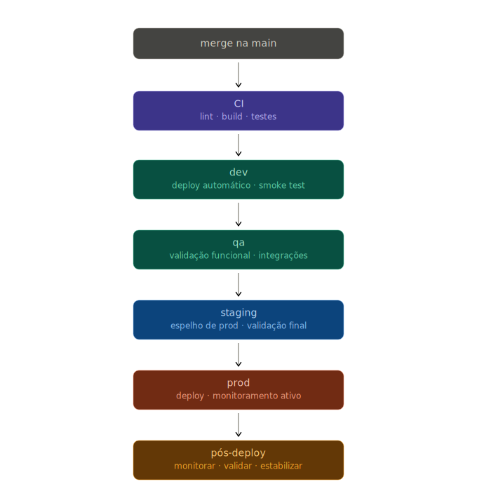

# CI/CD

> Escopo: transversal. Aplica-se a qualquer linguagem ou stack do projeto.

**CI/CD** (Continuous Integration, Continuous Delivery e Continuous Deployment, Integração Contínua, Entrega Contínua e Deploy Contínuo) é o
processo que garante que qualquer mudança no código passe por verificação automática antes de chegar
ao usuário.

**CI** (Continuous Integration, Integração Contínua) e **CD** (Continuous Delivery, Entrega Contínua) são processos distintos com objetivos diferentes. A estratégia de branches que viabiliza
esse fluxo está em [git.md](git.md).

| Processo                          | O que faz                                                           | Resultado           |
| --------------------------------- | ------------------------------------------------------------------- | ------------------- |
| **CI** (Integração Contínua)      | Valida qualidade a cada push (envio de código): lint, testes, build | Artefato verificado |
| **CD** (Entrega Contínua)         | Promove o artefato pelos ambientes até produção com aprovação manual no último estágio | Artefato pronto para produção |
| **CD** (Deploy Contínuo)          | Promove o artefato até produção automaticamente, sem aprovação manual | Código em produção  |

## Conceitos fundamentais

| Conceito | O que é |
|---|---|
| **Pipeline** (sequência de etapas de verificação) | Conjunto ordenado de estágios que todo código deve passar; cada estágio é um portão |
| **Lint** | Verificação estática de estilo e formatação do código |
| **Smoke test** (teste de fumaça) | Teste rápido do fluxo crítico após deploy para confirmar que o sistema responde |
| **Fix forward** (corrigir para frente) | Estratégia de corrigir bugs com um novo commit e deploy, sem reverter o histórico |
| **Rollback** (reversão) | Retorno do artefato em produção à versão anterior; reservado para emergências |
| **Pre-commit hook** (gancho de pré-commit) | Automação executada localmente antes de cada commit, com custo máximo de 5 segundos |

## Pipeline

O pipeline (sequência de etapas de verificação) é a sequência de verificações que todo código precisa passar. Cada estágio é um portão:
falhou, parou.

```
Lint → Segurança → Testes → Build → Deploy Staging → Smoke → Deploy Prod
```

| Estágio            | O que verifica                                | Critério de falha                 |
| ------------------ | --------------------------------------------- | --------------------------------- |
| **Lint**           | Estilo e formatação                           | Qualquer violação                 |
| **Segurança**      | Secrets expostos, vulnerabilidades conhecidas | Qualquer secret; CVE explorado    |
| **Testes**         | Comportamento esperado do sistema             | Qualquer falha                    |
| **Build**          | Compilação e empacotamento do artefato        | Qualquer erro de build            |
| **Deploy Staging** | Promoção para ambiente espelho                | Falha no health check             |
| **Smoke**          | Fluxo crítico funciona em staging             | Qualquer falha no caminho crítico |
| **Deploy Prod**    | Promoção para produção                        | Aprovação manual ou canary gate   |

O artefato que vai para produção é o mesmo que passou por staging. Fazer rebuild entre ambientes
invalida a garantia dos testes: o que foi verificado precisa ser o que é entregue.

## Ambientes

O mesmo artefato é promovido de ambiente em ambiente, sem rebuilds, sem branches por ambiente. Cada
etapa adiciona confiança antes da promoção seguinte.



| Ambiente  | Responsabilidade                                                       |
| --------- | ---------------------------------------------------------------------- |
| `dev`     | Primeira validação após merge: comportamento básico, sem regressão     |
| `qa`      | Validação funcional completa: cenários reais, integrações e edge cases |
| `staging` | Ambiente espelho de prod: última barreira antes da entrega real        |
| `prod`    | Entrega final: observabilidade ativa nos primeiros minutos após deploy |

### Pós-deploy

```
deploy prod → logs e métricas → smoke test → validar feature flag → estabilização
```

O deploy não encerra o ciclo. Após cada promoção para `prod`:

- Monitorar logs e métricas por tempo determinado (ex: 15–30 min)
- Confirmar que a feature flag está desativada se a feature ainda não é pública
- Validar o comportamento esperado com um smoke test manual ou automatizado
- Só encerrar o acompanhamento após estabilização

## Deploy e Release

Deploy e release são eventos independentes.

```
merge na main → deploy (automático) → feature flag desativada → release gradual → 100%
```

**Deploy** é o ato técnico de colocar o código em produção. Acontece automaticamente após merge na
`main` com pipeline verde.

**Release** é o ato de tornar a funcionalidade visível ao usuário. Controlado por feature flag,
acontece quando o time decide, de forma gradual.

Essa separação reduz o risco de cada entrega. O código pode subir para produção desativado, ser
validado com tráfego real em percentual controlado e só então ser ativado para todos.

## Feature Flags

Feature flags (interruptores de funcionalidade) separam o ciclo de vida do código do ciclo de vida
da feature.

| Situação                             | Ação                                        |
| ------------------------------------ | ------------------------------------------- |
| Feature em desenvolvimento           | Sobe desativada, código na `main` sem risco |
| Feature pronta, aguardando validação | Ativa para % do tráfego ou grupo interno    |
| Feature com problema                 | Desativa sem rollback de código             |
| Feature validada                     | Ativa para 100%, flag removida              |

Flags têm prazo de validade. Uma flag que nunca é removida vira débito técnico: condicionais
permanentes que crescem com o código.

## Pre-commit

CI detecta problemas tarde: após o push, na esteira. Pre-commit hooks (ganchos de automação) detectam imediatamente, antes
do commit.

```
código staged → lint → auto-fix → commit
```

O custo deve ser baixo: menos de 5 segundos para não criar atrito no fluxo de trabalho.

## Fix Forward e Rollback

Fix forward (corrigir para frente) é a abordagem preferida. A `main` segue para frente com histórico
linear.

```
bug em prod → PR na main → pipeline → merge → deploy
```

| Etapa       | Ação                                                      |
| ----------- | --------------------------------------------------------- |
| Identificar | Confirmar o comportamento inesperado via logs e métricas  |
| Isolar      | Desativar a feature flag se o bug estiver coberto por uma |
| Corrigir    | Abrir PR na `main` com a correção                         |
| Validar     | Pipeline verde: lint, testes, build                       |
| Entregar    | Merge e deploy seguindo o fluxo normal                    |
| Confirmar   | Monitorar logs após deploy para garantir estabilização    |

⚠️ Rollback é reservado para emergências: sistema indisponível e fix forward inviável no tempo
necessário. Reverte o estado da `main` e cria inconsistência com o histórico.

| Etapa      | Ação                                                         |
| ---------- | ------------------------------------------------------------ |
| Avaliar    | Sistema indisponível e correção inviável no tempo necessário |
| Reverter   | Rollback do artefato no ambiente de prod                     |
| Comunicar  | Notificar stakeholders (partes interessadas) sobre o incidente e a reversão        |
| Investigar | Identificar a causa raiz sem pressão de produção             |
| Corrigir   | Retomar pelo fluxo de fix forward após estabilização         |
